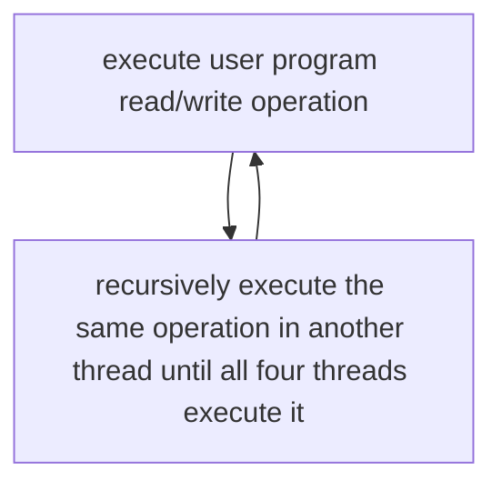

# Operating System Virtual Memory Simulation in CUDA

# Overview

In this assignment, I have completed both the basic VM simulation and the bonus task of multithreaded VM simulation, using C language and CUDA.
The following content will describe the relevant information of these two tasks I completed.

# Environment

<!-- ## OS Version

I use the university’s High Performance Cluster (HPC) for testing and running the CUDA program. The nodes run on a CenOS version 7.5.1804. 


## Kernel version

This is the kernel version of the HPC. Other versions should also be OK.

 -->

## CUDA Version

I use the CUDA compiler version 11.7 for compiling the CUDA program, using a Quadro RTX 4000 GPU as hardware. 

<!--  -->

<!-- ## GPU Info

For each node in the HPC, it is equipped with a Quadro RTX 4000 GPU. Each time the program only runs on one allocated node.

 -->

# Running the program

## Basic task compilation and running

To compile: inside the `source/` folder, there is a file named `slurm.sh`. On the HPC with slurm installed, we can directly use the shell script to compile and run the executable:

```
sbatch slurm.sh
```

On a device without slurm, one can first compile using 

```
nvcc --relocatable-device-code=true main.cu user_program.cu virtual_memory.cu -o test
```

and run `./test` to run the program.

<!-- ## Basic task sample outputs

On the first test program:


On the second test program (the one that was released later):


Note that for this task, it requires several seconds or more than 10 seconds to complete the program and produce the final page fault number. -->

## Bonus Task Compilation and running

Because the bonus task shares the same template structure with the basic task, the compilation and running steps are exactly the same as above, which means we could use:

```
sbatch slurm.sh
```

<!-- ## Bonus task sample output

Because in the bonus task, I adopted the third version approach to implement the multithreaded VM, which is to use 512kb for storage memory and the four threads do not overwrite each other. Therefore the execution time is estimated to be around **four times** as the basic task, which can take long (40 seconds or so) and please be patient to wait for the final output.

 -->

# Program Design

## Basic task design:

In this CUDA program, we simulate the physical memory (48kb, 32kb for data access and 16kb for page table) using shared memory. We simulate the secondary memory (disk), 128kb with global memory. We also implement a swap table in the global memory, with 4096 `u32` entries. We use the `LRU` algorithm as the page replacement policy, its detail will be described later.

### Designing the page table

In our implementation, the page size is 32 bytes. Therefore the total page entries is 32kb / 32 = 1024 entries. Because this count is limited, we implement an inverted page table using an array with 1024 entries. For each entry we use 64 bits, which contains one bit for on/off indication, 31 bits for storing the page number corresponding to that frame; and the rest 32 bits for storing its access count trace (for LRU implementation). This in total takes 8kb, which is less than the permitted size of 16kb and is adequate (in fact, we can use less bits because in the environment given, the page number is not so large as 31 bits and so as the access trace. But our implementation here is simper by using two `u32`s).


### Designing the function `vm_write` and `vm_read`

In the `vm_write` function, it takes an address and write value to that address. I distinguish it into 4 cases.

First, the address is separated into the page number and offset field by extracting the corresponding bits. Then, the page number is compared with each in the inverted page table.

**Case1:** the target address is found in the inverted page table. Then, directly write to the corresponding frame added with the offset.

**Case2:** there is an unused entry in the inverted page table. This means that the page does not exist yet. We allocate a new page, update the page table and write to the new frame.

If it’s not in case 1, then it is page fault and the count number will be increased. Then, the page number is compared with each entry of the swap table. The swap table uses the same structure with the inverted page table with 4096 entries, but not using the access trace field.

**Case3**: page is not found in inverted page table. But is found in the swap table. Then, swap the page in the disk with an LRU page, record the replaced frame number. Then, write to that frame.

**Case4**: page is not found in both page tables. This means that the page does not exist yet. We allocate a new page in an empty place in the disk, and swap that page with an LRU page. Then write.

In the `vm_read` function, given an address, we similarly extract the page number and offset. Compare the page number with each page table entry. There are 2 cases:

**Case 1**. page is found in inverted page table. Then, we return the value at `vm->buffer[frame_no*vm->PAGESIZE + offset]`

**Case 2**. page is not found in inverted page table. Then, we find in the swap table. The page that was found is swapped with an LRU main memory page. Then, return the value at `vm->buffer[swapped_frame_no*vm->PAGESIZE + offset]`

### About LRU

As mentioned above, in the page entry we use addition bits to store an `access trace`, which is essentially a counter that is added at each read or write operation. To choose an LRU page, we directly select the page with the minimum `access trace`.

## Bonus task design

In this bonus task, we’re required to simulate a multithreading scenario of the page table. Because it is inefficient to implement one page table for each thread, we use only one page table shared among the threads, and inside each entry, we use two bits to also record the thread number. Thus, **each thread performs read and wirte independent of each other, even with the same address.** Because of this need, the storage of the program in the basic task is expanded to **512kb**. This design is the same as the **third version** in the additional notes posted by TAs.

To simulate the multithread feature without worrying about the security / integrity issues, we launch one kernel thread, and maintain a thread id variable in the `vm` data structure indicating the thread number executing an instruction. We make each instruction executed in each thread in sequence before executing the next instruction. For the `vm_read` operation, we only return the result of the last `vm_read` in the fourth thread. This also means, that the `vm_snapshot` function will return all the content written by the fourth thread, because it uses `vm_read` .



# Page Fault number and analysis

## Basic task: test case 1

As show above in the program output, the page fault count for the first test program is **8193**. This is because, firstly we write 128kb, which is 4096 entries into memory. Because no page exist yet, so all 4096 pages will produce page fault.


Then, we read 32769bytes(32kb+1byte). The first 32kb is in main memory, so no page fault there. But when we read addition one byte, that will be one page fault.


Then in the `vm_snapshot`, we start from address 0, which is in page 0 and read 4096 pages. Therefore at the beginning there’s page fault. Therefore this is another 4096 page faults. 

So in total, there is 4096 + 1 + 4096 = 8193 page faults.

## Basic task: test case 2

The total page fault is **9215**, as shown in the output. In this addition test case, we first write 128kb, 4096 entries into memory starting from address 32*1024. This first step, like above, will give total page fault, 4096.

Then, we write (32kb-32b) data starting from 0. Because these are also new pages, so will give total page fault, (1024-1) = 1023. (because each page is 32 bytes).


Then, we read out VM[32K, 160K]. Because these pages are also not in the main memory, so also total page fault, 4096.

So in total 4096 + 1023 + 4096 = 9215 page faults.

## Bonus task: test case 1

As show above in the program output, the page fault count for the first test program is **35844**. This is because, first we write 128kb * 4, which is 4096 * 4 entries into memory. Because no page exist yet, so all 4096 * 4 =  16384 pages will produce page fault.


Then for each of the four threads it reads 32769bytes(32kb+1byte). 


The state of the main memory is:
<p align="center">
  
    
</p>
<!--  -->

First, we assume that all pages in the main memory are transferred into secondary memory. Thus, all reads will result in page fault, therefore in total 1025 * 4 = 4100 page faults.

Then, we minus the page reads that are already in the memory: 4100 - 1024 = 3076 page faults. Because the pages written last are read first, so no error here.

Then in the `vm_snapshot`, we start from address 0, which is in page 0 and read 4096 pages. Therefore at the beginning there’s page fault. Therefore this is another 4096 * 4 = 16384 page faults. 

So in total, there is 16384 + 3076 + 16384 = 35844 page faults.

# Project reflection and conclusion

Several problems I met in this assignment gave me valuable experience in solving them. The first is about the page table design. At first, I followed the regular page table design, which is to track both the frame number and the page number in one entry. But soon later I discovered that the inverted page table design is much more suitable for this. Because the frame number can be implicitly implied in the inverted page table design (by the index number), thus we only need to record the page number. Another problem is about how to implement multithreading. At first I thought we must launch four kernel threads by using `mykernel<<<1,4>>>`, however this would lead to very tough security and integrity problems, which can be out of my knowledge. I countered this issue by implementing a scheduling scheme such that each thread is executed after completion of previous thread by using recursive call and modifying the thread id attribute.

I think this project is a valuable experience for learning the hierarchical memory structure, including main memory and secondary and swapping between them, and more importantly, paging. I also learn the technique of writing CUDA programs, which are somewhat like C/C++ but need to distinguish CPU memory and device memory, global, shared and private variables, and allocating GPU heap memory.